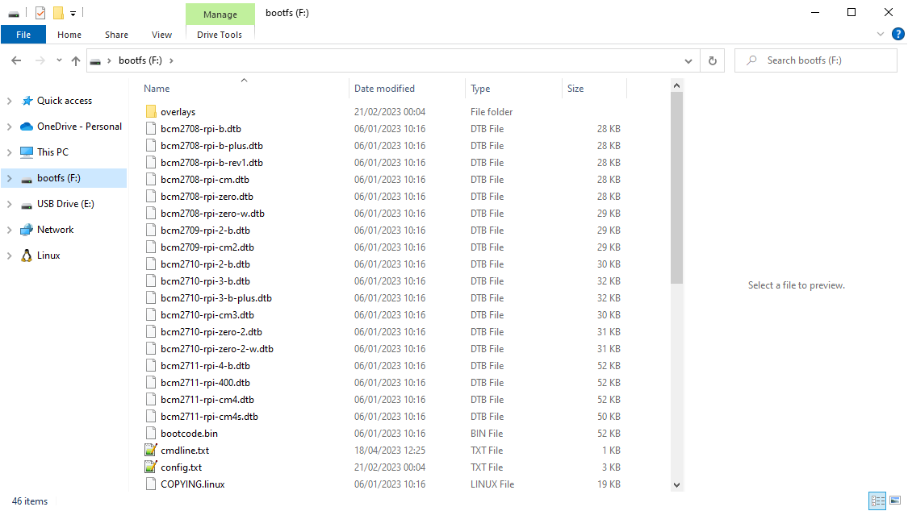
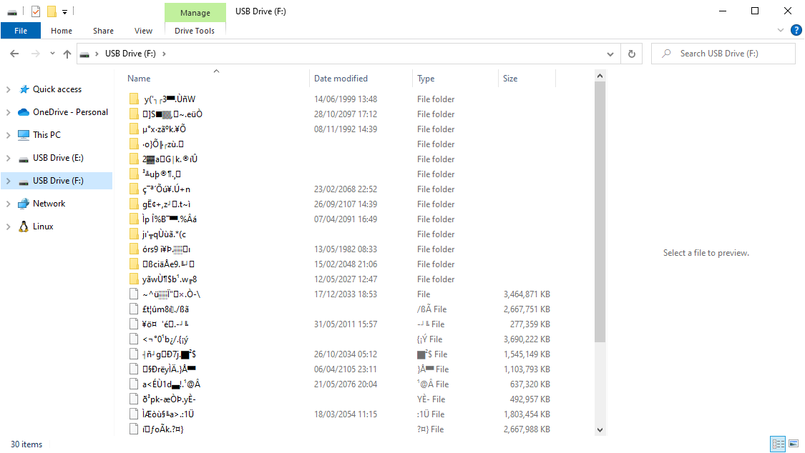

# Troubleshooting

## WSL & ping
If you are using WSL, you may need to run the following command (on your computer, not in an SSH session) to be able to use `ping`, which may come in handy for troubleshooting later on:
```sh
sudo setcap cap_net_raw+p $(which ping)
```
_cf_. https://github.com/microsoft/WSL/issues/5109


## Flashing the microSD card

The flashing process usually ends with a message that says something along the lines of "please remove the card", but that isn't always accurate. I found that the Imager sometimes doesn't "eject" the flash drive, and if I forget to do it myself in that case, then the memory card doesn't work and it needs to be flashed again.


_Above: what the microSD card contents should look like after completion_


_Above: what the microSD card contents may look like when flashing didn't complete properly_

My solution is to wait for a few seconds after the Imager finishes, then opening Windows Explorer. If the flash drive is still listed under My Computer, then I right click on it and select "Eject". Windows promptly informs me that I can safely remove the drive. At this point I still make an additional check by re-inserting the drive and inspecting its contents. If the contents look garbled, that's a sign that I should flash it again. Yes it was "verified", but still.

Usually, trying to start a Raspberry Pi with a garbled memory card shows nothing. The lights don't blink and nothing shows up on screen.

If I have updated my computer, restarted, tried again several times in a row and it still fails, then the memory card is probably broken. Sometimes I have another adapter, another USB port or something else I can try before I throwing out the memory card (or whatever component was causing the issue).


## Errors writing files on the system // broken MicroSD card

The type of memory cards used for Raspberry Pi boards is often very cheap and they break easily. They simply have a limited life span and they weren't built with robustness in mind, because they can be replaced cheaply. Sometimes they are even broken right out of the box. Other times you stored them somewhere and small tempretature or humidity changes broke them before you opened their box. Yet others work fine for a while, but then they fail at some point.

I find that broken memory cards tend to fail in the `apt update` or `apt upgrade` stages. Here is an example I got today:
```
Reading package lists... Error!
E: Encountered a section with no Package: header
E: Problem with MergeList /var/lib/dpkg/status
E: The package lists or status file could not be parsed or opened.
```

If you reboot the Raspberry Pi at that moment with a screen plugged in, you might observe a different boot sequence from the previous one, and this time it might say something about a "Kernel panic".

It's time to throw away this memory card and to try a new one. There is no repairing it.

Although, before you throw out your memory card, try flashing it again with a different adapter first, or a diferent computer.

Flash card life span is a good reason why we try to avoid writing log files when the system is running. We don't want the MicroSD card to break too fast. It's going to fail eventually, but writing files makes it happen much faster.

I've had PiHole running on the same MicroSD card for years now (I'm probably just lucky that the bad sectors are being avoided), but several cards have failed me out of the box in the last week. It seems unpredictable.


## Wi-Fi

When using the Raspbery Pi Imager, there are settings that automatically set up the Wifi for the Pi. This section shouldn't be needed if you used that.

If the WiFi isn't working on the Pi, try to plug in a keyboard and screen, using "pi" as a username and "raspberry" as the password (or whatever you set up in the Imager settings), then locate the WiFi config like this:
```sh
find /etc -name "wpa_supplicant.conf" -print 2>/dev/null
```
^ the file you want is probably under `/etc/wpa_supplicant/wpa_supplicant.conf`

Edit that file according to the WPA Supplicant documentation, which I won't repeat here.


## SSH from your computer to the Pi

If the `ssh pi@raspberry` command fails, try checking the permissions on your SSH key:
```sh
iot@desktop-gr:~$ whoami
iot
iot@desktop-gr:~$ ls -alh ~/.ssh
total 24K
drwx------ 2 iot iot 4.0K Apr 15 13:56 .
drwxr-xr-x 3 iot iot 4.0K Apr 15 13:56 ..
-rw------- 1 iot iot  419 Jun 14  2021 id_ed25519
-rw-r--r-- 1 iot iot  108 Jun 14  2021 id_ed25519.pub
-rw------- 1 iot iot 4.8K Apr 14 13:06 known_hosts
```

What's important here are the `r`, `w` and `x` flags, as we call them, on most of the lines after the last command. Of course, my user is called `iot` but yours will be different (you can check that by calling the `whoami` command).

Context: this output represent _read_, _write_ and _execute_ system permissions for the file's owner, for its group and for everyone else, respectively. So `-rw-------` means that the user can _read_ & _write_ but nobody else can do anything, while `-rw-r--r--` means that everybody can _read_, but only the user can _write_ and nobody can _execute_. The two lines that start with `d` represent folders (directories), the single dot being the folder being listed and the double dot its parent folder.

If the output isn't exactly like I'm showing above (we are looking at the first and last columns, except for the line that reads `..` at the end), that's probably why `ssh` fails. You can repair your system like this:
```sh
chmod 0700 ~/.ssh
chmod 0600 ~/.ssh/id_ed25519
chmod 0644 ~/.ssh/id_ed25519.pub
chmod 0600 ~/.ssh/known_hosts
```

Context: These commands change the permission bits on the folder and files where `1` means e`x`ecute, `2` means `w`rite and `4` means `r`ead. They are written in octal notation (that's what the leading zero means) so the second number is for the user, the third for the group, and the last for everyone else. The idea here is that only the public key should be readable by everyone on the system, none of these files and folders can be modified by anyone other than their owner (they are really private), and none of these files are available for execution by anyone (because they aren't programs).

Crash course in modern cryptography (asymmetric encryption): Here, the `~/.ssh/id_ed25519` file without the `.pub` is your private key while `~/.ssh/id_ed25519.pub` is your public key; if you ever lose your public key, it can be recreated from this private key. Essentially, both keys can encrypt messages but only the private key has the ability to decrypt them. The private key is also the only one that can compute a digital signature for a message, although both keys can then assess that signature. The inner workings are mathematically complex and I won't pretend to understand them, much less explain them here. The public key is the one you can freely share, and that's the one that other systems can use to encrypt messages so that only you can open them (with your private key). That's why the `ssh-keygen` tool suggests creating a password for the private key. Generally speaking, the use cases for asymmetric cryptography are: either you want to send an encrypted message to an individual without anyone else being able to read it, or an individual wants to send a message that anyone can read while ensuring that they have a way to verify the source of the message and that it wasn't modified in transit. This is the technology used for most communications between automated systems. For example, every time you visit a web page or whenever you use Signal/WhatsApp, a variation of this is in play behind the scenes.

Other reasons why `ssh` might fail are:
* the Raspberry Pi is not available on the network: try again in a minute or two?
* you have installed more than one Raspberry Pi with the same hostname over time and your `ssh` program is now confused, but it's also giving you directions for how to fix this;
* the hostname <> IP address resolution failed: if you can plug a screen, try looking for the IP address towards the end of the boot sequence;
* your computer's programs are out of date.

```sh
iot@desktop-gr:~$ ssh pi@rpiaudio
ssh: Could not resolve hostname rpiaudio: Name or service not known
```
^ Here I typed the hostname wrong, there is no box called `rpiaudio` on my network, instead it's `rpiaudio-gr`.

In most cases, a good way to find the issue is to run the following command. It's very verbose but it often points out the issue (with some googling around):
```sh
ssh -vvv pi@raspberry
```

Also, edit this file on the Pi if you need to add more SSH keys than your own:
```sh
nano ~/.ssh/authorized_keys
```


## Running some diagnostics

Check free disk space. A full disk is often the root cause of many issues. I can't tell you what to do if anything gets above 95% (`Use%` column with `dh`), you'll have to figure that out, but this is a good start.
```sh
df -h
sudo du -h --max-depth=0 /home /usr /var
sudo du -h --max-depth=1 /home /usr /var /run
sudo du -h --max-depth=3 /usr/local
```

Running any of the `*top` programs (Ctrl+C to exit)
```sh
top
htop
atop
sudo iotop
```

Check that Docker is running, which may possibly complain with some `WARNING` messages but it shouldn't bail with a message about the socket.
```sh
docker info

# or to automate it, try something like this (on two lines to make it more readable)
docker info --format "{{json .}}" \
  | jq -r "{Name, ServerVersion, KernelVersion, OperatingSystem, OSVersion, OSType, Architecture, Containers, ContainersRunning, Swarm}"
```

Check what Docker containers are running (also automatable with the `--format` parameter)
```sh
docker ps
docker ps --no-trunc
```
